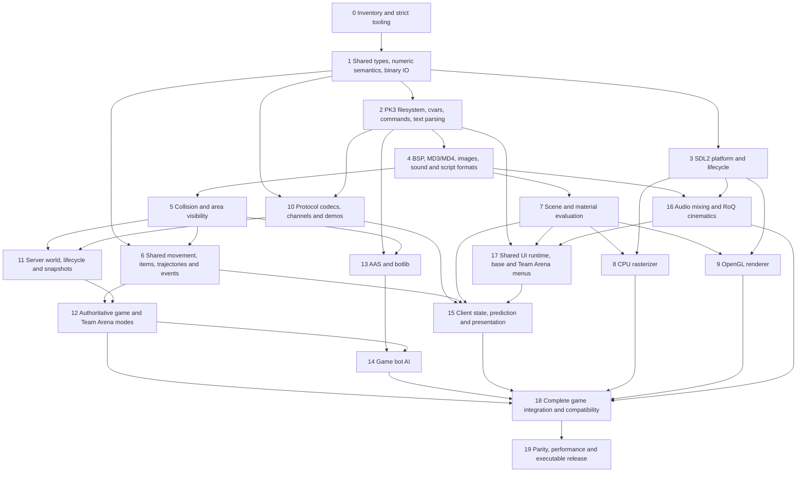

# Quake III Arena and Team Arena TypeScript port

## Scope and completion

Port the complete playable Quake III Arena 1.32b runtime and Team Arena to TypeScript. Preserve original gameplay, assets, command/config behavior, protocol 68 networking, demos, bots, menus, HUD, audio, and cinematics. Provide a CPU software renderer and an OpenGL renderer, both presented through SDL2. Run source directly with Bun and build executables with Bun.

All project implementation, tests, generators, and build tools are `.ts`. Configuration, Markdown documentation, license notices, and generated evidence are data. Do not add C/C++, JavaScript source, native addons, embedded C, shaders in a separate programming language, or a WASM engine. SDL2 and the system OpenGL implementation are platform dependencies. Bun's built-in system services and compression are permitted. Do not execute the original engine or retail QVMs as the implementation. An optional TypeScript QVM interpreter provides mod compatibility after direct TypeScript game modules work.

Enforce strict TypeScript, checked indexed access, exact optional properties, no implicit returns or switch fallthrough, and no ignored diagnostics. Reject explicit `any`, unsafe inferred `any`, casts including const assertions, non-null assertions, definite-assignment assertions, ambient declarations that hide implementation, and suppression comments. Runtime binary/FFI/CLI input must narrow through checked boundaries. `satisfies` and ordinary typed constructors are allowed.

The source checkout and supplied archives are reference inputs, not dependencies of the shipping game. Read retail PK3s from a selected installed data directory. Preserve attribution and the license obligations of translated files. Do not redistribute retail data.

Perfect means every in-scope source behavior has an implementation and evidence, every acceptance gate below passes, and there are no known correctness gaps. A map viewer, placeholder menu, toy match, or passing typecheck does not complete this project.

## Source baseline

Reference: `/home/buzzkill/Projects/qsrc/quake-iii-arena`, commit `dbe4ddb10315479fc00086f08e25d968b4b43c49`. Its master matches the supplied bundle. The supplied zip is the 1.32b release. [Reference inventory](docs/GROUNDING.md) records local assets and runtime checks.

| Original area | C/header files | Lines | Target responsibility |
| --- | ---: | ---: | --- |
| qcommon | 27 | 30,217 | Common runtime, filesystem, codecs, collision, compatibility VM |
| game | 64 | 50,502 | Shared definitions/movement, authoritative game, game bot AI |
| cgame | 24 | 27,887 | Snapshots, prediction, entities, effects, HUD |
| q3_ui | 47 | 24,910 | Base-game menus and single-player progression |
| ui | 11 | 16,374 | Team Arena menu runtime and shared HUD widgets |
| server | 11 | 8,980 | Connections, world links, game hosting, snapshots |
| client | 19 | 15,757 | Client transport/input, audio, cinematics, console |
| renderer | 27 | 24,250 | Asset/scene/material behavior, GL backend |
| botlib | 53 | 34,690 | AAS, movement planning, goals, weapons, chat, parser |

Counts include headers and inactive branches, not just build inputs. A generated manifest must record each original file, build membership, target files, status, and evidence. Classify obsolete platform implementations as replaced by SDL2/Bun, and bundled compression/library internals by replacement or translation. Track lcc/q3asm, q3map/bspc, editor code, and legacy packaging separately. They are not prerequisites for playing shipped content, but their exclusion must be explicit in the inventory. Required runtime formats and mod compatibility remain in scope.

## Dependency map

Arrows mean the downstream unit requires the upstream contract and behavior.

The function-by-function pass found missing source behavior in previously accepted units. Those corrections and the final integration gate were accepted for the declared profiles. The completed graph remains a record of that work. Newly discovered follow-up work is tracked separately in docs/PARITY_PUNCH_LIST.md, not by reopening milestones. Current evidence and limitations are recorded in docs/STATUS.md. All 941 source inputs and 56 build scripts have examination accounts in docs/SOURCE_EXAMINATION.md. Examination alone does not establish implementation or parity.



The graph represents implementation dependencies. Runtime game/server calls in both directions use interfaces and separately owned state, without circular module imports. The shared Team Arena widget runtime is below cgame and menus. Game movement and client prediction use the same simulation. The CPU and GL renderers use the same material and scene preparation.

## Milestones and acceptance gates

The milestone records below remain completed. New discoveries after completion have their own parity punch list. They do not retroactively change these records or establish unrestricted source parity.

M19's documented release gate is accepted as of September 10, 2026, with all twenty milestone gates accepted for the declared runtime profiles. The 12:12 UTC executable contains the completed source-account corrections, reconnect-time filesystem fix and reviewed CPU/GL optimizations. All eight final raw/compiled × product/backend cases pass movement/fire, managed-error recovery, fresh admission, video restart, screenshots and normal shutdown. Root inspected the combined evidence and verified source/build and published executable agreement. Sixteen recordings contain 432 active snapshots. The source ledger distinguishes 273 implemented, five replaced and nine inapplicable core inputs; it does not relabel them verified. [Release evidence](docs/RELEASE.md) records reproducible commands and the retained artifacts. This accepts the stated performance/allocation work, not a playable-FPS threshold or universal native equivalence. Actual compiled timedemos remain slow, especially CPU; optimization continues under the user's next phase.

M9 is accepted for the selected renderer profiles as of September 10, 2026. Existing driver/readback, shader and model-path evidence is joined by original q3dm1/mpteam1 screenshots and independently reviewed draw-level explanations. The accepted comparison contract and its explicit exceptions are recorded under "Renderer comparison profiles" in docs/COMPATIBILITY.md. Root reran the current Team Arena capture and original sort/mip comparisons, then inspected CPU, GL and original images. This is not universal GPU pixel identity: deterministic CPU ideal-rho sampling differs from hardware approximations, and the deliberately stricter client-level diagnostic still fails on those profiles. No production sampling or depth correction was justified. M19 retains final integration and performance acceptance.

M5 is complete as of September 10, 2026. Root reran 36 point/box/capsule sweeps against unchanged original world collision: actual q3dm1 treads/risers and q3dm2 water entry, exit, submersion and masks. Both cases pass, 128 assertions, including exact axial endpoints. Four original point-contents probes also match. Existing curved/transformed/start-solid comparisons retain their documented numeric tolerances and the explicitly repaired temporary-capsule oracle profile. Evidence: `/tmp/quake3-collision-retail-cJNIRl/REPORT.md` and `root-retail.log`. No collision production correction was required.

M10 is complete as of September 10, 2026 for the stated protocol gate. Root independently repeated original-client to current raw TypeScript-server pure admission, movement/fire, reliable chat, map replacement, reconnect and normal shutdown for both products. Six complete native recordings contain 354 active snapshots and progressing authoritative movement, ammunition and fire events. Existing original packet, channel-loss, demo and reverse-direction evidence supply the other criteria. The independent reference uses stack-alignment compiler flags and a process-local executable-memory profile required by its original JIT, not a protocol patch. This does not claim original retail executable identity or arbitrary-mod equivalence. Evidence: `/tmp/quake3-stock-reciprocal-j8HgGm/REPORT.md` and both `*-root1` runs. No project protocol correction was required.

M6 is complete as of September 10, 2026. Root reran the original-QVM comparison for both products: all 127 replay rows match position/velocity bits, recorded timers, event sequence, both event IDs and both parameter slots. The joined movement suite passes 50 cases and 386 assertions without skips. Independent review found no unmet literal M6 criterion when combined with existing item eligibility and movement-mode fixtures. The replay produces 13 events and repeated ring wraps; its parameters are zero because original `PM_AddEvent` always supplies zero. This is not evidence for arbitrary nonzero-parameter producers. Actual BSP water/stair collision comparisons remain M5. Evidence: `/tmp/quake3-movement-events-XPPvtv/pmove-run.sh` and `root-tests.log`. No production correction was required.

The M2 key-file omission is corrected: filesystem startup reads the base and selected mod keys, and client archive saves persist the UI-selected key. Synthetic checks cover startup, restart, restricted mode, dedicated behavior and save ordering. Live product selection and actual pure-package error cleanup pass raw CPU and GL played-match menu round-trips. The source preprocessor fixed-decimal correction is also integrated. These changes are in the September 10 04:44 UTC executable, published to dist and the user's qfiles/q3a copy. Compiled startup/capture and actual menu selection in both switch directions pass on CPU and GL, with an active match after each switch. The compiled directions use separate processes; the raw check covers the complete round-trip. Dated gate records below are not an overall coding percentage or certification of later changes.

M7 is complete for the selected runtime profile as of September 10, 2026. Root and independent review reconciled the literal scene/material comparison, all-map visibility and shader-corpus criteria. Eight current corpus/reference cases pass with 26,573 assertions. The retained57-map union is joined by current default-camera CPU/GL q3tourney4 captures and actual both-product test_bigbox world/model draws. The latter test now observes actual source-tessellation draws and initializes the model axis; an earlier whole-frame difference was not proof of model visibility. Root's corrected selection passes6 cases/100 assertions, and independent review confirms its draw attribution. No selected-profile M7 implementation gap remains identified. Evidence: `/tmp/quake3-root-m7-final-selection.log`, `/tmp/quake3-m7-final-default-UxpKy6/`, `/tmp/quake3-root-bigbox-final-join.log`. Original pixel tolerances and release performance remain M9/M19 gates.

M0 is accepted as of September 9, 2026: the pinned 473-file inventory, strict policy enforcement, TypeScript-only implementation and Bun build are verified. Final per-behavior ledger closure remains M19 work, not an unfinished M0 prerequisite. Later milestone acceptance is separate from the availability of its implemented contracts for downstream work.

M1 is complete as of September 9, 2026. Root's current numeric/binary/math/shared selection passes 64 cases and 1,049 assertions; independent source review covers all 204 definition/trajectory enum values and both stat schemas. The existing candidate `/tmp/quake3-current-port-build-7vGmAm/quake3-ts` contains the exact current math, binary, numeric and definition files, including the bounds correction; its previously completed both-product runs resolve the recorded executable-integration item. Published `dist` is unchanged. The later raw mod-state migration remains M18 integration work, not a missing numeric prerequisite.

M2 is complete as of September 9, 2026. Current filesystem, command/cvar, parser and config acceptance passes 384 cases and 7,063 assertions without failures or skips. Root independently reran both installed product mounts, package checksums, actual config replay/startup ordering and retained touch-file behavior: 12 cases and 102 assertions. The source retained reader deliberately omits payload CRC checks; diagnostic archive readers remain separate. No production blocker remains for the stated M2 gates.

M4 is complete as of September 9, 2026. Both product corpuses load through the implemented formats. Independent inspection covers 8,629 retained BSP, MD3, image, WAV and RoQ results with content hashes and package provenance. Shader, skin, animation and menu traversal and cross-reference checks are recorded in STATUS.md. Root reran the existing script selection: 95 cases and 19,882 assertions pass. Existing malformed-data checks cover format boundaries and internal references. Original rejected shader text and missing retail skin targets retain source behavior. Scene rendering and A/V timing are separate M7/M9/M16 gates, not unfinished M4 work.

M8 is complete as of September 9, 2026. Independent review and root inspection cover all six stated criteria: analytic pixels/depth, shared-edge coverage, transparency ordering, retail scenes, deterministic frames and measured frame cost. Root's current rasterizer selection passes 29 cases and 119 assertions. The latest unchanged-pixel 640×480 q3dm1 baseline measures 68.406110 ms renderer median and 69.885444 ms p95; the instrumented full pass measures 86.207209 ms median. No numeric speed threshold was specified for M8. These measurements establish its timing evidence, not release-speed acceptance or original-GL parity. Those remain M19 and M9. Evidence: `/tmp/quake3-cpu-dispatch-performance-HZrdtx/baseline.log` and the retail CPU paths in STATUS.md.

M11 is complete as of September 9, 2026. Independent source and gate review covers server lifetime, deterministic frames, visibility/portals, admission, downloads/pure validation, restart/reconnect and independent client/server instances. Root's current seven-file server selection passes all 313 cases and 3,690 assertions using actual retail mounts and local peers. Two stale test connections to filesystem startup were investigated; one test was corrected without changing production or weakening ownership checks. Evidence: `/tmp/quake3-m11-current-tmPG9V/server.log`. Full mode-specific matches remain M12/M14/M18 work, not unfinished server acceptance.

M12 is complete as of September 9, 2026. Root reran the existing controlled retail matches for all seven modes, including FFA and CTF in both products. All 175 gates and nine independent seeded replays pass. These cover actual game admission, scoring, objective callbacks, intermission, ready input and restart requests. Retained original state/event/score fixtures and hosted natural matches supply the separate reference and executed-lifecycle evidence. Root inspected these after independent gate review. The controlled runs do not execute queued engine commands or claim whole-match original-engine equivalence. Evidence: `/tmp/quake3-m12-current-VdKXTZ` and the hosted match paths in STATUS.md.

M13 is complete as of September 9, 2026. Independent review found the complete BotLibrary service composition and evidence for all shipped AAS/bot files, reference routes/reachability/goal choices, deterministic seeds and independent contexts. Fresh corpus/composition checks passed; seven stale token-lifetime expectations were corrected against PC_UnreadSourceToken/PC_ReadSourceToken, then independently rerun by root with all 98 assertions passing. Two corpus cases exceeded Bun's default timeout and passed unchanged with an explicit timeout. Retained native-reference records and root's current AAS checks are identified in STATUS.md. Full retail-map bot match navigation remains M14, not unfinished M13 service integration.

M15 is complete as of September 9, 2026. Independent review combines existing demo, command, loss, teleport, restart and repeated-event checks with actual gameplay on both renderers. The remaining obelisk/shield effects and 56 product-specific player states render through actual presentation and retail resources on CPU. M17 supplies complete HUD-definition coverage. Root inspected the helpers, results and images. Seeded visual states are labelled fixtures, not earned gameplay or new GL-reference comparisons. Evidence: `/tmp/q3-special-render-qWzjMD` and `/tmp/quake3-player-overlays-F8BLAh`. Original-renderer parity remains the separate M9 gate.

M16 is complete as of September 9, 2026. Sample/mix/spatial fixtures, complete installed WAV/RoQ decoding, source clock/EOF/loop/PCM-offset checks and actual dummy-SDL queue/lifecycle evidence meet the stated gate. Retained cinematic playback reaches actual EngineSound and queued PCM while video advances. Source raw-ring delivery, filename handling and all nine missing cinematic diagnostics are integrated and independently reviewed. Root's joined audio/cinematic/demo/picture selection passes 253 cases and 61,958 assertions, with one unrelated retail picture case skipped; typing and policy pass. SDL-delivered time is the declared platform replacement, not a claim of physical speaker latency or original native DMA identity.

M17 is complete as of September 9, 2026. Existing base-menu flow evidence and the Team Arena coverage union establish the stated parse/render and settings/start/join/team/postgame navigation gates. All 68 Team Arena definitions are accounted for: 45 UI definitions and 23 distinct HUD definitions, preserving duplicate names by source location. The remaining HUD definitions rendered through actual retail resources and the CPU rasterizer. Offscreen Team Arena input returned postgame to Skirmish and started active mpteam2 through Next; SDL key input rebound Forward to F8, saved it in a private config and restored it on reload/reopening. HUD states and the Team Arena postgame seed are explicitly fixtures, not earned-match evidence. Root inspected the helpers, results and images after independent review. Paths are recorded in STATUS.md. Full effects/state parity and end-to-end competitive matches remain their separate M9/M12/M15/M18 gates.

M18 is complete as of September 9, 2026. All four current-source product/backend combinations passed actual menu input, movement/fire, natural timed intermission, ready input and fresh pure next-map admission, followed by clean shutdown. These are one-human FFA flows. Retained independent network peers, source-bot matches, actual demo playback and authored-module integration supply the other stated gates. Root inspected the runners and logs after independent reconciliation. Team Arena CPU's second timelimit print was a distinct old-map command generated during a residual server step, matching original ExitLevel/Com_Frame ordering. No restart fix was needed. Evidence paths are in STATUS.md. Original-renderer parity, stock-peer interoperability and final executable release remain M9, M10 and M19.

M14 is complete as of September 9, 2026. Natural matches cover all seven modes. Root reconciled autonomous navigation logs against every shipped BSP/AAS pair: 55 maps, including 44 new finite dedicated runs. Two new CTF runs ended scoreless but reached enemy flags and recorded combat; they are not capture-return proofs. The remaining inventory entries are two BSPs without AAS and an AAS without its BSP. Actual CPU/memory measurements, heap checks, map replacement and reviewed allocation bounds supply the resource evidence. Independent gate review found no further unmet M14 requirement. Setup stalls, sampled RSS and the limits of finite observations remain explicit M19 performance work. This does not establish whole-match original-engine equivalence. Paths and qualifications are in STATUS.md.

M3 is complete as of September 9, 2026. Existing actual SDL window, CPU framebuffer, GL context/readback and lifecycle evidence is joined by current raw and privately compiled typed-input smoke. The existing smoke now initializes SourceInputState before a window, delivers injected native keys through SdlGameInput and ClientKeys, preserves held/queued state and the input lease across restart, retains shared synthetic joystick state across window replacement and closes its owners idempotently. Root independently ran both final artifacts and passed current typing. The smoke calls SourceInputState.restart directly; existing common-frame checks and source inspection cover engine command dispatch separately. Dummy SDL uses no physical devices. Physical joystick/gamma behavior remains qualified, not claimed from injected input. The published game executable is unchanged.

| ID | Work | Evidence required before completion |
| --- | --- | --- |
| 0 | Inventory original source/build inputs and assets; establish TypeScript policy checker, typecheck, tests, Bun build, source coverage ledger | Reproducible manifest; checker rejects unsafe samples and catches unsafe inferred types; every project code file is TypeScript |
| 1 | Vectors/matrices, float32 and integer semantics, seeded random, endian and bit IO, stable product-specific state types | Original numeric and byte fixtures, overflow/NaN/bounds tests, independently verified base/missionpack numeric mappings |
| 2 | PK3 ZIP index, CRC/inflation, case/path rules, loose-file and pack precedence, pure-pack metadata, cvars/latches, command buffer/tokenizer, configs | Mount retail baseq3 and missionpack; precedence/security/malformed input tests; config command replay |
| 3 | Typed Bun FFI SDL2 window/event/input/clock/audio lifecycle, GL context/procedure loading, CPU presentation | Actual SDL window lifecycle, injected input, CPU framebuffer readback, GL context/readback, idempotent cleanup, raw and compiled smoke tests |
| 4 | All 17 BSP v46 lumps, entity strings, patches, visibility, lightmaps/grid, MD3 frames/tags/skins, MD4 skeletal models, TGA/JPEG, WAV, shader/menu/animation scripts | Load every shipped map/model/image/sound/script; validate cross references and corrupted/truncated data; preserve content hashes in local evidence |
| 5 | BSP traversal, brush clipping, bounding boxes/capsules, transformed traces, patch facets/bevels, point contents, area portals, world linking | Original-reference point/box/capsule sweeps including stairs/curves/water/start-solid; render tessellation never substitutes for patch collision |
| 6 | Shared item table, product enums/stat schema, trajectories, event generation, weapon timing, movement and step-slide | Recorded command replays compare positions/velocities/timers/events; product item eligibility matrix; slope/stair/water/air/jump/dead/spectator cases |
| 7 | BSP surface selection/PVS, patch subdivision and LOD cracks, model animation/tags, skin/shader lookup, stages, sorting, tc/rgb/alpha generation, deformations, fog, lightmaps/dlights/sky | Captured scene and material outputs against original; visible-surface probes on all maps; shader corpus coverage without silent fallbacks |
| 8 | TypeScript clipping, perspective-correct rasterization, depth/culling, texture filtering/mipmaps, stage blending/alpha test, fog/light, overlays | Analytic pixel/depth fixtures, edge/top-left coverage, transparent ordering, retail scenes, deterministic frame hashes, measured frame budget |
| 9 | SDL GL context, typed fixed-function GL entry points, indexed batches/textures/state, parity with scene/material semantics | Driver/readback tests, original scene screenshots with documented tolerances, all shader effects and model paths; genuine GL geometry rendering |
| 10 | Protocol 68 Huffman, exact delta fields, float encoding, reliable commands, UDP/loopback, netchan fragments/qport/XOR, demo formats | Original packet fixtures byte-for-byte, lossy/reordered/duplicated channel tests, demo decode/replay, stock peer interoperability |
| 11 | Server lifetime/map restart, entity ownership and collision links, configstrings/baselines, admission/download/pure handling, snapshots/portals/timeouts | Deterministic server frames, visibility fixtures, connect/map-change/reconnect tests, multiple local client instances without shared globals |
| 12 | Spawning, all entities/triggers/movers, clients/spectators, combat/weapons/missiles, items/powerups, sessions/ranks/votes, tournament/FFA/TDM/CTF and all Team Arena objectives | Complete scripted matches for each mode; original state/event/score traces; missionpack holdables/weapons/obelisk/cubes and win/intermission/restart tests |
| 13 | Bot script preprocessing, AAS v5 reader, areas/reachability/clusters/routing, movement/avoidance, goals/items, weapons, fuzzy decisions, chat | Load all shipped AAS and bot files, reference route times/reachability/goal choices, deterministic seeds and independent bot contexts |
| 14 | Bot game-state awareness, team orders, opponent/item/objective decisions, movement and input production, chat integration | Full bot matches for every mode, navigation completion on retail maps, objective use and bounded CPU/memory |
| 15 | Connection/gamestate/snapshot histories, input commands, prediction/reconciliation, interpolation, player/model/weapon animation, effects/marks/local entities, camera/HUD/scoreboard | Demo and command replay, loss/teleport/restart/event-repeat tests, all effects/HUD states, gameplay with both renderers |
| 16 | WAV mixing/resampling, spatialization/loops/music, SDL queued audio, ADPCM compatibility, RoQ video/audio and cinematic timing | Known audio sample/mix fixtures, spatial probes, device lifecycle, complete retail cinematic decode and A/V timing checks |
| 17 | Text/fonts/widgets, base menus, Team Arena preprocessor/menu language, shared cgame HUD, settings/key binding, progression, server browser | All retail menu definitions parse and render; actual keyboard/mouse navigation for settings/start/join/team/postgame flows |
| 18 | Common event loop and frame scheduling, dedicated/listen/client modes, configs/console, downloads, demo recording/playback, typed QVM compatibility if needed for mods | End-to-end launch→menu→match→intermission→restart for both games/backends; real local network peers, bot matches and demos |
| 19 | Source ledger closure, refutation review, exact behavior/parity checks, performance/allocation work, crash/restart resilience, Bun executable packaging | All milestone gates pass; no placeholders or silent unsupported features; raw and compiled results agree; documented reproducible release commands |

## Implementation shape

The independent design comparison selected source-aligned owned modules. [Architecture and synthesis](docs/ARCHITECTURE.md) records the contracts and adopted snapshot/batch ownership rules. Use these knowledge boundaries:

```text
src/core          numeric primitives, typed binary IO, tokenizer, commands/cvars
src/assets        PK3 mounts and validated game asset formats
src/platform      SDL2/Bun handles, events, audio device and GL procedure access
src/collision     BSP queries and independent patch collision
src/shared        product definitions, state, items, trajectories, movement
src/render        scene/material preparation, cpu/, gl/
src/protocol      messages, Huffman, delta schemas, netchan, demos
src/server        engine server lifecycle, world links, snapshots
src/game          authoritative base and missionpack rules and entities
src/botlib        AAS and reusable bot services
src/cgame         snapshot-driven client presentation and prediction
src/audio         mixing, spatialization, music and codecs
src/cinematic     RoQ decoding and playback
src/ui            shared widgets and product-specific menus
src/engine        composition, client state and common frame loop
src/main.ts       CLI entry point
tools             TypeScript build, audits and repeatable verification
tests             unit, fixture, retail integration and differential checks
```

Source state lifetimes matter. Server static state survives map changes; server world state does not. Client static state survives disconnect, connection state survives a gamestate reset, and active state resets with a new gamestate. Encode these as separate owned objects. Movement scratch state is per invocation or per simulation instance. Preserve command-driven human movement, bot/synchronous frame movement, and the event loop's second drain before client presentation.

## Work allocation

Use a soft maximum of 25 live agents, excluding the lead. Start independent unblocked work immediately and refill completed slots; do not invent work to fill the cap. Give workers exclusive files. Announce each agent's name, model, effort and task immediately before each launch or reactivation. Use Astra only until the user changes that instruction. Lower effort receives bounded functions, source references, explicit contracts and concrete validation cases. The lead owns shared contracts, plan/status, source ledger integration and end-to-end verification. Agents must not weaken the type policy, edit other agents' files, or claim milestone completion from local tests alone.

First implementation wave after synthesis: strict tooling/inventory, core math/binary/text, PK3 filesystem, SDL2 boundary, and product definitions. Second wave: BSP/MD3/images/audio, collision, material evaluation, and protocol primitives. Integration happens after each wave before dependent work expands.

## Verification and reporting

Keep a source coverage ledger and append-only decision trail with commands and evidence. Track `planned`, `in-progress`, `implemented`, and `verified` separately. Source presence is not behavior coverage; test count is not parity. Record unsupported cases and failed checks openly until fixed.

Use the original binary or an independently built reference outside this repository only to record fixtures and compare behavior. Keep retail fixtures local and regenerate them from the installed data. Verification must include real SDL/GL calls, real retail parsing, deterministic simulation, actual input, both renderers, network peers, and executables. Headless testing may use SDL dummy video for CPU and Xvfb for GL; the interactive path also needs exercise.

### Historical implementation checkpoints

The records below describe earlier source states, permissions and unresolved work. They are superseded by the milestone acceptance records above and the current RELEASE.md, STATUS.md and COMPATIBILITY.md. They do not set current permissions or establish current blockers.

September 8 19:13 checkpoint: the executable includes source bots, AAS generation/routing, source-ordered BSP/collision, external GAME, stereo sequencing, allocated renderer state, bounded command/draw-surface sorting, retained visibility and live lighting/rail controls. The latest M7 → M8/M9/M15 unit executes procedural entities at the reached source draw boundary. Actual raw CPU client-level checks pass for both games; the preceding 18:29 binary also passed both compiled dedicated products. The new binary's CLI startup is verified, not a fresh compiled gameplay run. Earlier selected-map bot matches cover all seven modes, but full map/mode coverage, graphical acceptance, compatibility and parity remain open. No device or native reference execution was authorized at that checkpoint.

Earlier renderer/client phase report (11:09 executable): both product controllers and the graphical client/listen owner are integrated. M2 retained reads and pure/config restart now reach M10/M15 downloads, authorization, demos and retail module selection; M16 retained music/RoQ callers; and M7 projected/stencil shadows, dynamic lights, patch LOD and world portal views on both backends. Music disposal and source UDP send-error failures are fixed. A source temporary-box correction permits two-human CTF capture/intermission, including actual pure validation on CPU and GL with a compiled remote peer. Actual raw-client FFA combat, One Flag and Harvester objective probes also pass on both backends. Client MOTD is integrated. The compiled TypeScript client plays through original native pure admission for both products; reciprocal native-client acceptance is blocked by reference crashes. Stencil frontend/backend/caller integration has independent review and actual both-product client/restart proof. Text deformations are integrated and independently reviewed. Portal-sorted entity/model prepasses are integrated and independently reviewed. Source image upload/mip/filter handling, native pixel selection and actual Graphics Apply are integrated after source and caller review. CPU and GL menu runs pass post-restart movement/fire and filter retention. Reached source-empty flare dispatch and silent cinematic audio gating are also integrated; the 11:09 executable includes these units and passes actual base CPU/Team Arena GL restart, movement/fire and recording checks. Video-mode selection and pre-INFO cinematic audio update ordering are integrated after independent review. The native stencil-clear correction passes NVIDIA and Mesa; the separate first-sky depth issue remains open. These are bounded units, not whole-milestone closure.

The latest full check began at September 6, 21:40 UTC on input 6d3ea9c69f98fd2fbf958e32b019bd81916dbdf73cc58acc81cef953f2edac27, 1,282 inputs. Main tests: 4,510 passed, 84 skipped, zero failed. Selected actual GL: 473 passed, two skipped, zero failed. The GL selection repeats suites. The matching executable and frozen raw source passed eight dedicated UDP profiles and eight retail viewer runs. This includes the menu chain through Postgame, cvar lifecycle, sound-buffer ownership, server reads/mod discovery/Mods and SDL input. Later client admission, configstring-aware connection drawing and mixer timeline changes are independently reviewed and integrated, with 1,083 combined tests passing, but are outside that frozen check/build.

Work follows this dependency chain:

1. M2 shared filesystem and COM_ParseExt -> M17 arena/bot catalog and SP progression -> Difficulty/start and Add Bots, now integrated. The filesystem/parser/interpolation branch supplies the actual player preview -> Controls and Player Model/Settings, also integrated. Start Server/Server Options/Bot Select -> Level Select and progression -> Postgame are independently reviewed and integrated. Remove Bots and Demos are integrated command-generating consumers, not substitutes for client execution.
2. M3/M16 actual SDL audio device and mixer -> sound-buffer clearing -> M2 server-relative reads and mod discovery -> M17 Mods [all integrated]. SDL input, admission, packet delivery/rate gating and source command sending are integrated. Browser/status -> ArenaServers and renderer configuration -> Graphics/Driver Info/Display are integrated. Main/Setup/In-game -> base controller -> engine screen -> graphical startup/frame/connection owner -> listen-client application are joined and exercised through actual CPU/GL maps, recording/replay and renderer restart. A new client executable passed bounded CPU demo and GL map checks, separately from the older full-tree checkpoint. Cinematics read current audio output and await actual system-menu closure. Common-lived local CD-key state remains credential-file-free. Subsequent raw source joins engine sound services -> sound-disabled/unavailable-device cgame and Team Arena string storage/metadata -> arena/bot catalogs and player-model listing. Cached-server persistence, saved scores, selections, resource registration, content lists and actual-session player lists are integrated. Shared menu allocation/loading/reload, input and postgame transitions are integrated, followed by actual browser/status/search, connection drawing, cinematic traps, visibility and settings callbacks. Feeders, Team Arena player previews, source refresh and console commands are integrated after independent review and a joined retail run. Owner drawing/key dispatch, scripts and full product initialization/EngineClient composition are now independently reviewed and integrated. Actual CPU and OpenGL base-client runs reach timed intermission, ready input and the next map with a fresh match clock. Broader live matches and existing input, gamma, sound timing, renderer and memory qualifications remain open.
3. Those owners plus M11/M12 hosting/gameplay -> M18 normal menu-to-match play for both products and renderers. Team Arena retail Main -> Start Server -> Create Server now reaches active q3ctf1 CTF and cgame/HUD initialization on CPU and OpenGL. The longer menu run exposed a source byte-color conversion bug, now corrected without changing fade logic. Complete team/objective matches and physical input remain open.
4. In parallel, M2 unique retained handles -> M16 music and RoQ callers [integrated], and M2 pure/config restart -> M10/M15 actual downloads/authorization/demos/retail module selection [integrated after review]. M7 projected shadows and patch stitching/LOD -> world portal views plus CPU/GL clip-plane execution -> projected dynamic lights [integrated]. Source UDP send errors and client MOTD are integrated. Stencil geometry/CPU/GL execution and scene/caller integration are active exclusive-file branches. The 06:16:56 executable includes the earlier wave but predates MOTD, dynamic lights and stencil work.
5. The separate M13/M14 bot branch, remaining workflows and renderer parity -> complete M18 and M19 release acceptance.

Root superseded the earlier incremental-inflater-first design constraint. The real PK3 reader uses the already-permitted Bun inflater on first nonzero read; open captures the actual entry/header and size without decoding. Whole-entry allocation and CRC/error timing remain explicit parity gaps. No refused audit was retried. Directory listing uses unsorted Node enumeration, omits dot entries and rejects symlinks. These qualifications do not disappear because a downstream caller can now run.

The implemented M13 → M14 → M18 bot path includes stored retail navigation, generation/save lifecycle, persisted routing caches and autonomous selected-map matches. Later collision and renderer work is included in the current executable above. The M4 → M18 QVM reader/interpreter, role adapters and external UI/cgame/GAME loading are now connected in source. Authored external GAME modules pass actual server initialization, recursive calls and restart; broader compatibility remains open. Retail gameplay remains direct TypeScript. Current source work connects actual common, renderer, collision, snapshot and bot allocations across those owners, then verifies their combined lifecycle. Source mapping percentages are not overall completion estimates; see [current evidence and remaining work](docs/STATUS.md). Implementation continues under the user's full-port request.
